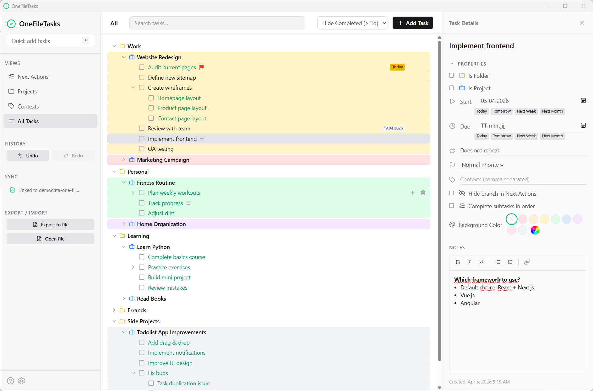

# OneFileTasks

A local-first, single-file task manager built with React and Tauri. Organize your work with hierarchical tasks, multiple views, and rich text notes—all stored locally with no cloud dependency. Deploy as a standalone HTML file or a native desktop application.

## Features

- **Hierarchical Task Organization** - Create nested tasks, projects, and folders
- **Multiple Views** - Switch between Next Actions, Projects, Contexts, and All Tasks
- **Rich Text Editing** - Format task notes with bold, italic, links, and lists
- **Recurring Tasks** - Set up daily, weekly, monthly, or yearly task recurrence
- **File Sync** - Optional JSON file sync with File System Access API
- **Local-First Architecture** - All data stored locally in IndexedDB, no cloud required
- **Dark Mode** - Full dark mode support with Tailwind CSS
- **Single-File Distribution** - Build as a standalone HTML file for easy sharing
- **Cross-Platform Desktop** - Package as native Tauri app for Windows, macOS, and Linux

## Demo

- Standalone HTML file demo: https://michaelber.github.io/OneFileTasks/dist/index.html (download and run locally)
- Example data: https://michaelber.github.io/OneFileTasks/demo/demodata-one-file-tasks.json



## Release

- Download latest release: https://github.com/michaelber/OneFileTasks/releases

## Development

**Prerequisites:** Node.js 18+, Rust 1.80+ (required only for Tauri desktop builds)

### Run in Browser

1. Install dependencies:
   ```
   npm install
   ```
2. Start the development server:
   ```
   npm run dev
   ```

### Build Options

#### Single HTML File (Browser-Based)
Create a standalone HTML file with all code and assets bundled:
```
npm run build
```
Output: `dist/index.html` - open directly in any browser, no server needed.

#### Desktop Application (Tauri)
Build a native desktop application for Windows, macOS, or Linux:
```
npm run tauri build
```
Output: Executable bundles in `src-tauri/target/release/bundle/`

##### Generate custom app icon (optional)
```
npm run tauri icon ./src-tauri/icons/icon.svg
```
